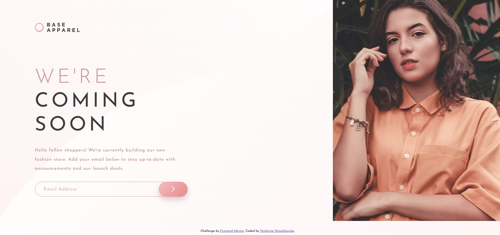

# Frontend Mentor - Base Apparel coming soon page solution

This is a solution to the [Base Apparel coming soon page challenge on Frontend Mentor](https://www.frontendmentor.io/challenges/base-apparel-coming-soon-page-5d46b47f8db8a7063f9331a0). 

## Table of contents

- [Overview](#overview)
  - [The challenge](#the-challenge)
  - [Screenshot](#screenshot)
  - [Links](#links)
- [My process](#my-process)
  - [Built with](#built-with)
- [Author](#author)

## Overview

### The challenge

Users should be able to:

- View the optimal layout for the site depending on their device's screen size
- See hover states for all interactive elements on the page
- Receive an error message when the `form` is submitted if:
  - The `input` field is empty
  - The email address is not formatted correctly

### Screenshot

### Links

- Solution URL: [https://www.frontendmentor.io/solutions/base-apparel-coming-soon-page-solution](https://www.frontendmentor.io/solutions/base-apparel-coming-soon-page-solution-rvbNIWDms7)
- Live Site URL: [https://voitsekhovska.github.io/base-apparel](https://voitsekhovska.github.io/base-apparel/)

## My process

### Built with

- Semantic HTML5 markup
- CSS custom properties
- Flexbox
- CSS Grid
- Desktop-first workflow

## Author

- Website - [@voitsekhovska](https://github.com/voitsekhovska)
- Frontend Mentor - [@voitsekhovska](https://www.frontendmentor.io/profile/voitsekhovska)